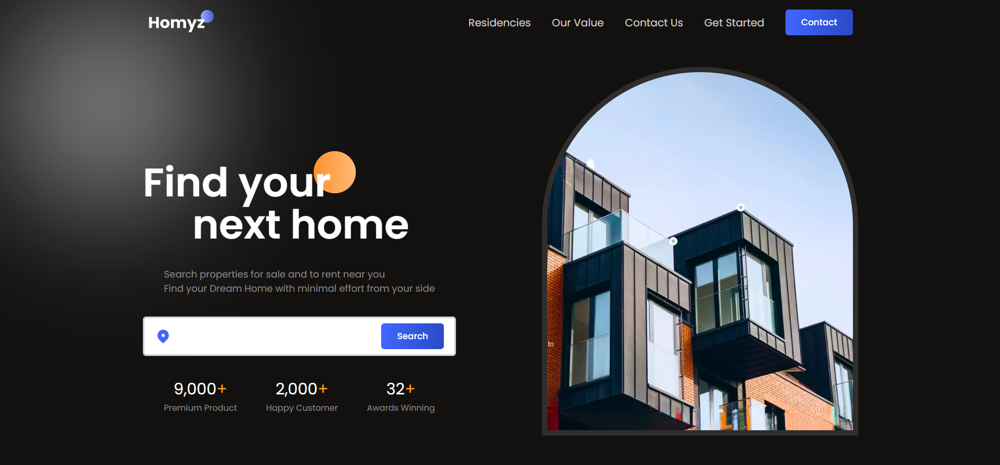

# Real Estate Website

A Real estate website built using React.

## Table of contents

- [Overview](#overview)
  - [Screenshot](#screenshot)
  - [Links](#links)
- [My process](#my-process)
  - [Built with](#built-with)
  - [What I learned](#what-i-learned)
- [Author](#author)

## Overview

### Screenshot

### Links

- Solution URL: [Solution URL](https://github.com/AshwanthramKL/RealEstate_Website)
- Live Site URL: [Live site URL](https://cool-muffin-bc66c8.netlify.app/)

## My process

### Built with

- Semantic HTML5 markup
- CSS custom properties
- Javascript
- React

### What I learned

This project helped me learn and practice various concepts of React and Firebase as follows:

- Components

## Author

- Website - [MARTIALEAGLE](https://github.com/AshwanthramKL)
- Frontend Mentor - [@AshwanthramKL](https://www.frontendmentor.io/profile/AshwanthramKL)
- Twitter - [@AshwanthramKL](https://www.twitter.com/AshwanthramKL)
